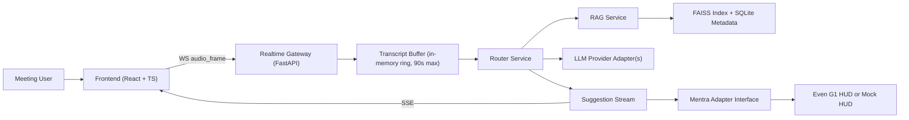

# Layla Copilot Architecture and Types Contract (v1)

Status: Proposed for team sign-off  
Version: `v1.0.0`  
Canonical path: `/Users/michael/Documents/University/group-project/layla-copilot/docs/architecture-and-types.md`

## 1. Purpose and scope
This document is the team-wide technical contract for the Layla Smart Glasses Copilot. It defines:
- The end-to-end system architecture.
- Module boundaries and ownership.
- The normative API and realtime protocol contracts.
- Shared payload and error types.
- Privacy, performance, and compatibility rules.
- Test and change management requirements.

In scope:
- React + TypeScript frontend.
- Python 3.11 + FastAPI backend.
- Realtime audio ingest, suggestion streaming, and RAG-assisted routing.
- Mentra integration interface with mock fallback.

Out of scope for v1:
- Final production hardening for all providers.
- Hardware-only flows that cannot be validated in mock mode.
- Breaking API changes.

Assumptions and defaults:
- Repo is scaffold-heavy; this contract is intentionally implementation-guiding.
- Mentra hardware/SDK may be temporarily unavailable; mock adapter is mandatory.
- Local-first RAG is required for v1; cloud dependency is optional.
- Breaking schema changes require `/api/v2`.

## 2. System context and component diagram (text/mermaid)
Context:
- User speaks during meeting; frontend captures mic (and optional screen context controls).
- Audio frames / transcript stream to backend.
- Backend manages short in-memory transcript context, performs retrieval and routing, and emits suggestions.
- Suggestions are rendered on web HUD and forwarded to glasses adapter (Mentra or mock).



## 3. Module boundaries and ownership by team member
1. Frontend capture module (`frontend/capture/*`)
- Owner: Aneurin
- Responsibilities:
  - Browser mic capture.
  - Optional screen capture controls.
  - `AudioFrame` WS uplink. (possibly split into recording mode)
     - Transcript snippet streaming to API (for processing suggestions / commands)
  - Local speaking/silent trigger state.

2. Frontend HUD module (`frontend/hud/*`)
- Owners: Alex, Amos
- Responsibilities:
  - Suggestion overlay UI.
  - SSE subscription and render lifecycle.
  - Privacy mode toggle (UI + request flag wiring).

3. Backend realtime engine (`backend/realtime/*`)
- Owner: Adhish
- Responsibilities:
  - WS ingress endpoint.
  - In-memory transcript ring buffer.
  - Latency timing spans and observability fields.

4. Router + glasses adapter (`backend/router/*`, `backend/adapters/*`)
- Owner: Vlad
- Responsibilities:
  - Provider-agnostic router.
  - Mentra adapter interface.
  - Mock adapter fallback (must remain demo-ready).

5. AI/RAG (`backend/rag/*`)
- Owner: Michael
- Responsibilities:
  - Document ingestion (PDF/text).
  - Embedding + FAISS indexing.
  - Retrieval responses with citations.
  - Context injection into router.

6. Integration/docs/demo (`docs/*`, demo scripts)
- Owners: Amos, Alex (with contributions from all)
- Responsibilities:
  - Demo runbook.
  - Architecture diagrams and test evidence.
  - Progress and final handoff documentation.

## 4. Data flow (mic/screen -> backend -> router/RAG -> HUD)
1. Frontend obtains permissions and opens WS session.
2. Frontend streams `TranscriptSnippet`s to `/api/v1/stream/transcript/update`.
   - Possibly also streams `AudioFrame` messages to `WS /api/v1/stream/audio`(recording mode / later adaptation in `v2`)
3. Realtime engine validates frames and appends decoded content to bounded in-memory transcript buffer.
4. Router builds `RouterSuggestRequest` from transcript window and privacy flags.
5. Router calls RAG query path (`POST /api/v1/rag/query`) for contextual snippets.
6. Router composes prompt with transcript + retrieved snippets + meeting metadata.
7. Router gets model output from provider adapter and maps it to `Suggestion`.
8. Suggestion is emitted as `SuggestionEvent` over SSE and optionally forwarded to Mentra/mock adapter.
9. Frontend HUD renders suggestion; deduplicates by `suggestion_id`.

## 5. API contract (HTTP/WS/SSE)

### 5.1 API versioning
- Base path: `/api/v1`.
- Compatibility policy: only additive, non-breaking changes in `v1.x`.
- Breaking changes (field removal/rename, semantic contract break, endpoint removal) require `/api/v2`.

### 5.2 HTTP endpoints (normative)
1. `POST /api/v1/rag/documents`
- Purpose: ingest and index a PDF or text document.
- Request: `DocumentIngestRequest`
- Success response: `DocumentIngestResponse` (`200`)
- Errors: `ErrorEnvelope` (`400`, `409`, `422`, `500`)

2. `POST /api/v1/rag/query`
- Purpose: retrieve relevant snippets for a meeting query.
- Request: `RagQueryRequest`
- Success response: `RagQueryResponse` (`200`)
- Errors: `ErrorEnvelope` (`400`, `422`, `500`)

3. `POST /api/v1/router/suggest`
- Purpose: generate next suggestions from transcript window + context.
- Request: `RouterSuggestRequest`
- Success response: `RouterSuggestResponse` (`200`)
- Errors: `ErrorEnvelope` (`400`, `422`, `500`, `503`)

### 5.3 Realtime endpoints (normative)
1. `WS /api/v1/stream/audio`
- Client -> server message: `AudioFrame`.
- Server -> client control messages:
  - `audio_ack`
  - `audio_nack` (includes structured error)

2. `GET /api/v1/suggestions/{meeting_id}` (SSE)
- Event type: `suggestion`
- Payload type: `SuggestionEvent`
- Reconnect support: `Last-Event-ID` and event `id`.

## 6. Shared type definitions (canonical field-level schema)
Source-of-truth model names are backend Pydantic models; TypeScript types are generated from OpenAPI.

### 6.1 Core metadata types
```ts
type ISO8601 = string;

type ObservabilityMeta = {
  request_id: string;
  meeting_id: string;
  latency_ms: number;
  model_provider: string;
  retrieval_hit_count: number;
  timestamp: ISO8601;
};
```

### 6.2 RAG types
```ts
type SourceType = "pdf" | "text";

type DocumentIngestRequest = {
  doc_id: string;
  source_type: SourceType;
  source_path: string;
  title?: string;
  tags: string[];
  overwrite?: boolean; // default false
};

type DocumentIngestResponse = ObservabilityMeta & {
  doc_id: string;
  chunks_indexed: number;
  embedding_model: string;
  index_version: string;
};

type RagQueryRequest = {
  meeting_id: string;
  query: string;
  top_k?: number; // default 5, max 20
  min_score?: number; // default 0
};

type Citation = {
  source_doc_id: string;
  snippet_id: string;
  start_char?: number;
  end_char?: number;
};

type RagSnippet = {
  snippet_id: string;
  text: string;
  source_doc_id: string;
  score: number;
  citation: Citation;
};

type RagQueryResponse = ObservabilityMeta & {
  query: string;
  snippets: RagSnippet[];
};
```

### 6.3 Router and suggestion types
```ts
type RouterSuggestRequest = {
  meeting_id: string;
  transcript_window: string; // in-memory derived, never persisted
  no_record_mode: boolean;
  top_k_context?: number; // default 5
};

type Suggestion = {
  suggestion_id: string; // stable/idempotent for same inference output
  response: string; // e.g. "clarify budget"
  rationale: string;
  confidence: number; // 0..1
  citations: Citation[];
  latency_ms: number;
};

type RouterSuggestResponse = ObservabilityMeta & {
  suggestion: Suggestion;
};

type SuggestionEvent = ObservabilityMeta & {
  event_id: string; // SSE id
  event_type: "suggestion";
  suggestion: Suggestion;
};
```

### 6.4 Realtime audio message types
```ts
type AudioFrame = {
  type: "audio_frame";
  meeting_id: string;
  seq: number;
  sample_rate: 16000 | 24000 | 48000;
  channels: 1 | 2;
  encoding: "pcm16";
  chunk_ms: number; // recommended 20-100
  pcm16_b64: string;
  sent_at: ISO8601;
};

type AudioAck = {
  type: "audio_ack";
  meeting_id: string;
  seq: number;
  request_id: string;
  timestamp: ISO8601;
};

type AudioNack = {
  type: "audio_nack";
  meeting_id: string;
  seq: number;
  error: ErrorBody;
  request_id: string;
  timestamp: ISO8601;
};
```

### 6.5 Standard error envelope
```ts
type ErrorBody = {
  code: string;
  message: string;
  details?: Record<string, unknown>;
};

type ErrorEnvelope = {
  error: ErrorBody;
  request_id: string;
  timestamp: ISO8601;
};
```

## 7. Error handling and retry semantics
HTTP:
- `400`: malformed request; client must fix payload.
- `409`: doc ingest conflict (existing `doc_id` without `overwrite=true`).
- `422`: validation failure.
- `500`: internal error.
- `503`: provider unavailable; retry allowed with backoff.

WS (`/stream/audio`):
- Invalid `AudioFrame` -> send `audio_nack`; do not terminate session for first offense.
- Repeated invalid frames (>=3 consecutive) -> server may close with policy code.
- Client retries by resending next valid frame; no server replay.

SSE (`/suggestions/{meeting_id}`):
- Server emits `id` for each `SuggestionEvent`.
- Client must reconnect with `Last-Event-ID`.
- Frontend must dedupe by `suggestion.suggestion_id`.
- Retry strategy: exponential backoff (1s, 2s, 4s, max 15s).

Idempotency:
- `suggestion_id` must remain stable for the same routed inference output.
- Duplicate `SuggestionEvent` deliveries must not create duplicate HUD cards.

## 8. Privacy and security constraints
1. Transcript storage policy:
- Transcript content lives in memory only (ring buffer capped at 90 seconds).
- Transcript must never be persisted to filesystem or durable DB.

2. Logging policy:
- No raw transcript tokens/strings in logs.
- Log only aggregate counters and timing metadata.

3. `no_record_mode` behavior:
- Must be present in `RouterSuggestRequest`.
- When `true`, transcript retention must be minimized to active processing window only.

4. Secrets and credentials:
- Provider keys in environment variables only.
- Never committed to repository.

5. Data handling:
- RAG indexed corpora may be persisted (documents/chunks/embeddings metadata).
- Any user conversational content is non-persistent by default in v1.

## 9. Performance and latency budget breakdown
SLO:
- End-to-end P95 latency from final audio chunk acceptance to emitted suggestion <= 1500ms.

Target budget (guidance):
- WS ingest + validation: 50ms
- Transcript window build: 100ms
- Retrieval (embed/query FAISS): 250ms
- Router prompt assembly: 100ms
- LLM inference: 800ms
- SSE publish + HUD render: 200ms
- Total budget: 1500ms

Performance mitigation order:
1. Reduce retrieval `top_k`.
2. Use smaller/faster model adapter.
3. Shorten transcript window and prompt template.
4. Emit partial suggestion and finalize asynchronously.

## 10. Versioning and compatibility rules
1. API namespace versioning:
- Current: `/api/v1`.
- Breaking changes require `/api/v2`.

2. Non-breaking changes allowed in `v1.x`:
- Add optional request fields.
- Add response fields that clients can ignore.
- Add new endpoints without changing existing endpoint behavior.

3. Breaking changes (not allowed in `v1.x`):
- Remove or rename existing fields.
- Change required/optional field semantics incompatibly.
- Remove endpoint or change status code contract.

4. Contract governance:
- Contract changes must be reviewed by at least one frontend owner and one backend owner.

## 11. Test and acceptance matrix

| Category | Test case | Method | Pass criteria |
|---|---|---|---|
| Contract validation | OpenAPI contains required endpoints and schemas | CI schema check | All required paths and models present |
| Contract validation | Generated TS types compile | Frontend build/typecheck | Zero type errors from generated contracts |
| Realtime protocol | Valid `AudioFrame` accepted | WS integration test | Server returns `audio_ack` with matching `seq` |
| Realtime protocol | Invalid `AudioFrame` rejected | WS integration test | Server returns `audio_nack` with structured error |
| Realtime protocol | SSE reconnect semantics | SSE integration test | Client resumes from `Last-Event-ID` without duplicates |
| Realtime protocol | Suggestion dedupe | Frontend integration test | Duplicate event id/suggestion id renders once |
| Privacy | No transcript persistence | Runtime audit + grep | No transcript files/artifacts created |
| Privacy | No transcript in logs | Log inspection tests | Logs contain no raw transcript strings |
| Performance | 50-utterance latency benchmark | Benchmark harness | p50/p95 reported with trace IDs |
| Performance | SLO enforcement | Benchmark + gate | Fails if p95 > 1500ms without mitigation note |
| Integration | Retrieval citations in suggestions | End-to-end test | `Suggestion.citations.length >= 1` on retrieval hit |
| Integration | Empty retrieval safe fallback | End-to-end test | Valid suggestion response with empty citations |
| Integration | Mock glasses path | Adapter integration test | Suggestion payload delivered to mock HUD adapter |

## 12. Change management process
Type ownership and generation workflow:
1. Source of truth is backend Pydantic models.
2. FastAPI OpenAPI schema is exported from backend.
3. Frontend TypeScript types are generated from OpenAPI.
4. Manual frontend/backend duplicate type definitions are prohibited.

Contract change workflow:
1. Propose model/API changes in backend Pydantic and route definitions.
2. Regenerate OpenAPI and frontend TypeScript types.
3. Update this document only if contract semantics changed.
4. Submit PR with:
   - Backend model changes.
   - Generated TypeScript updates.
   - Updated tests.
   - Changelog note summarizing compatibility impact.
5. Require review from one frontend owner and one backend owner before merge.

PR checklist for contract-impacting changes:
- [ ] Backward compatibility assessed (`v1.x` additive vs `v2` breaking).
- [ ] OpenAPI updated and committed.
- [ ] Frontend generated types updated and compile.
- [ ] Realtime behavior (WS/SSE) integration tests pass.
- [ ] Privacy constraints unchanged or explicitly revised with approval.

